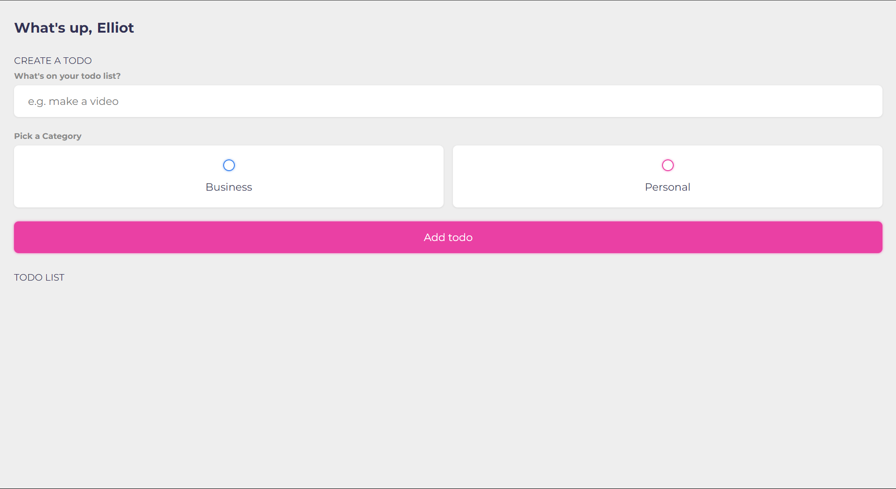
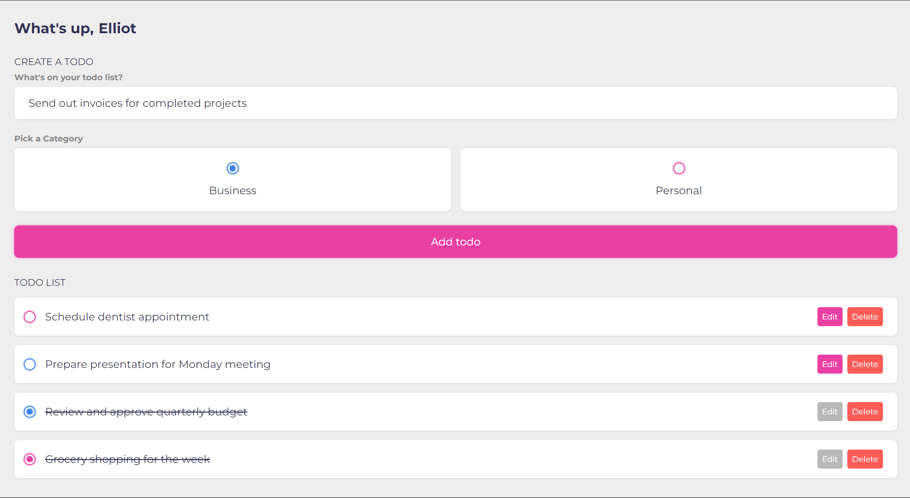

# Todo App

Welcome to the Todo App repository! This is a simple and elegant todo list application that utilizes local storage to save and manage your tasks. The app is built using HTML, CSS, and JavaScript, making it lightweight and easy to run in any modern web browser.

## Features

- *Create Tasks*: Users can easily create a new todo by entering the task content.
- *Category Selection*: Each todo can be categorized as either business or personal, providing organization and clarity to the user's tasks.
- *Edit Tasks*: Modify the content of your tasks.
- *Mark as Done*: Mark tasks as completed, which will move them to the bottom of the list.
- *Delete Tasks*: Remove tasks from the list.
- *Persistent Storage*: All tasks and the username are saved in local storage, ensuring that your data persists even after refreshing the page.

## Screenshots

 

## Demo

You can check out the live demo of the app [here](https://vishnuswaroop-ps.github.io/Todo-App/).

## Getting Started

### Prerequisites

To run this project, you only need a web browser.

### Installation

1. Clone the repository:
   bash
   git clone https://github.com/VishnuSwaroop-PS/Todo-App.git
   
2. Navigate to the project directory:
   bash
   cd Todo-App
   
3. Open the index.html file in your web browser.

## Usage

1. Enter your name in the input field under "What's up," and it will be saved for future visits.
2. Add a new task by filling in the description and selecting a category. Click "Add todo" to save the task.
3. Your tasks will be displayed in the "TODO LIST" section, where you can mark them as done, edit, or delete them.

## Code Overview

### HTML

- The HTML structure is divided into three main sections: Greeting, Create Todo, and Todo List.
- Each section contains the necessary elements and placeholders for user interaction.

### CSS

- The CSS provides a clean and modern design using variables for consistent theming.
- It includes styles for inputs, buttons, and the overall layout to ensure a responsive and visually appealing interface.

### JavaScript

- The JavaScript code handles the app's functionality, including loading and saving data to local storage, managing user interactions, and dynamically updating the UI.
- Key functions include displayTodos, which updates the task list, and event listeners for creating, editing, and deleting tasks.

## Contributing

Contributions are what make the open-source community such an amazing place to be, learn, inspire, and create. Any contributions you make are **greatly appreciated**.

1. Fork the Project
2. Create your Feature Branch (`git checkout -b feature/AmazingFeature`)
3. Commit your Changes (`git commit -m 'Add some AmazingFeature'`)
4. Push to the Branch (`git push origin feature/AmazingFeature`)
5. Open a Pull Request

## License

This project is licensed under the MIT License. See the [LICENSE](LICENSE) file for details.

## Acknowledgements

- Font: [Montserrat](https://fonts.google.com/specimen/Montserrat) from Google Fonts.
- Icons and additional design inspiration from various online resources.

## Contact

For any inquiries or feedback, please contact me at [vishnuswaroop20@gmail.com].

---

Thank you for checking out the Todo App! Your contributions and feedback are always welcome.

---
